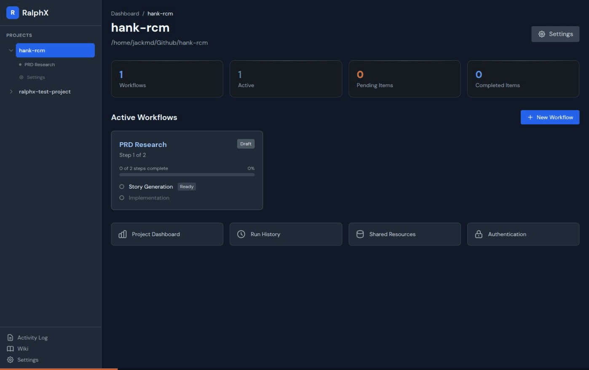
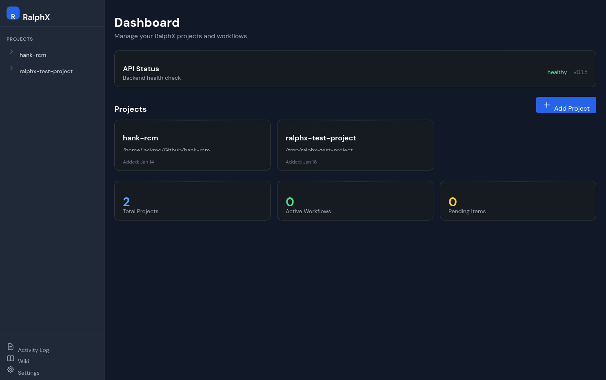
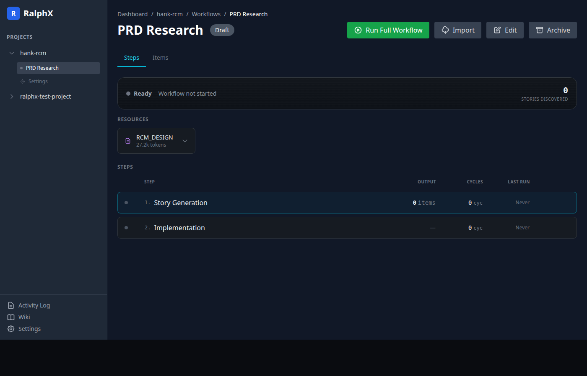

# RalphX



**From idea to working, tested code. Autonomously.**

RalphX orchestrates Claude Code to run your entire product development lifecycle: research an idea, generate a design doc, write user stories, implement features, and test everything. Each step runs as a configurable loop with fresh context but memory of what's been completed.

[](https://badge.fury.io/py/ralphx)
[](https://opensource.org/licenses/MIT)
[](https://www.python.org/downloads/)

---

## The Full Lifecycle

```
┌──────────────┐    ┌──────────────┐    ┌──────────────┐    ┌──────────────┐    ┌──────────────┐
│    Idea      │ ─▶ │ Design Doc   │ ─▶ │ User Stories │ ─▶ │ Implement    │ ─▶ │    Test      │
│              │    │ (+ research) │    │              │    │              │    │              │
└──────────────┘    └──────────────┘    └──────────────┘    └──────────────┘    └──────────────┘
       │                   │                   │                   │                   │
  "Build an app      Web search +         50-200 stories      Code for each       CLI, API, UI
   that does X"      synthesis            with criteria        story               testing
```

**Start anywhere.** Bring your own design doc, or let RalphX research and create one. Jump straight to implementation if you already have stories.

---

## How It Works

Each workflow step runs as a **configurable loop**:

1. **Fresh context** - Each iteration starts clean, no token bloat
2. **Memory of progress** - Knows what's done, what's next
3. **Recursive iterations** - Run until complete or hit limits
4. **Real-time monitoring** - Watch progress in the dashboard

```
┌─────────────────────────────────────────────────────────────────┐
│  Story Generation Loop (iteration 12 of 50)                     │
│  ─────────────────────────────────────────────────────────────  │
│  ✓ 47 stories generated                                         │
│  ● Currently: Generating API authentication stories...          │
│  ○ Remaining: Payment processing, notifications                 │
└─────────────────────────────────────────────────────────────────┘
```

**Run your way:**
- Run the entire workflow end-to-end until completion
- Run individual steps/loops one at a time
- Jump back and forth between steps as needed
- Pause, resume, or restart anytime

---

## Quick Start

```bash
pip install ralphx && claude mcp add ralphx -- ralphx mcp
```

Then tell Claude:

> "Register this project and help me build a workflow from my idea for [describe your app]"

Or if you have a design doc:

> "Register this project and create a planning workflow from my README"

Open `http://localhost:16768` to monitor progress.



---

## What Each Step Does

### Research & Design (optional)
Start from an idea. Claude searches the web, synthesizes findings, and builds out a comprehensive design document.

### Story Generation
Feed in a design doc (yours or generated). Claude extracts user stories with:
- Clear titles and descriptions
- Acceptance criteria
- Priority and categorization

### Implementation
Claude implements each story autonomously:
- Reads the codebase for context
- Writes code that fits your patterns
- Creates tests alongside features

### Testing (coming soon)
Verify everything works:
- **CLI testing** - Run commands, verify output
- **Backend testing** - API endpoints, database operations
- **UI testing** - Chrome/Playwright automation via Claude

---

## The Dashboard



**Monitor everything in real-time:**
- See which step is running and iteration progress
- Watch Claude's actual output as it works
- View generated stories and implementations
- Start, pause, or stop workflows anytime

---

## Workflow Templates

Pre-built workflows for common patterns:

| Template | Steps |
|----------|-------|
| **New Product** | Research → Design Doc → Stories → Implement → Test |
| **From PRD** | Stories → Implement → Test |
| **Feature Add** | Impact Analysis → Tasks → Implement → Test |
| **Bug Fix** | Import Issues → Triage → Root Cause → Fix → Verify |
| **Security Audit** | Scan → Prioritize → Remediate → Verify |

Ask Claude: *"Set up a new-product workflow starting from my idea for a task management app"*

---

## Coming Soon

**Testing Loops:**
- CLI/backend testing as workflow steps
- Chrome/Playwright UI testing via Claude
- Recursive test-fix cycles until green

**Integrations:**
- GitHub Issues - Import bugs and features directly
- Jira - Sync with existing project management
- Sentry - Turn production errors into bugs
- Slack - Notifications when workflows complete

**Triggers:**
- Scheduled workflows (cron-style)
- Webhook triggers from CI/CD
- Git push/PR triggers

**Subscription Management:**
- Auto-switch to backup subscription when usage limits hit

**Mobile Access:**
- Mobile-friendly dashboard for monitoring on the go
- Remote access setup instructions in the wiki

---

## Manual Installation

```bash
# Create conda environment
conda create -n ralphx python=3.11 -y
conda activate ralphx

# Install RalphX
pip install ralphx

# Register your project
ralphx add /path/to/your/project

# Start the dashboard
ralphx serve
```

---

## Per-Project Subscriptions

Configure different Claude subscriptions per project. Great for:
- Separating personal vs work usage
- Managing team billing
- Tracking costs per project

---

## Why RalphX?

| Problem | RalphX Solution |
|---------|-----------------|
| Claude Code loses context on long tasks | Fresh context per iteration with memory of progress |
| Manual prompting is tedious | Autonomous loops run while you do other work |
| Hard to track what's done | Real-time dashboard shows exact progress |
| Starting from scratch is overwhelming | Research step builds design docs from ideas |
| No visibility into AI work | Watch Claude's actual output as it works |
| Mixed billing across projects | Per-project subscription configuration |

---

## CLI Reference

```bash
ralphx add <path>           # Register a project
ralphx serve                # Start dashboard
ralphx doctor               # Check prerequisites
ralphx why <workflow>       # Explain why something stopped
```

---

## MCP Tools (67 total)

Claude gets full access to RalphX:

| Category | What Claude Can Do |
|----------|-------------------|
| **Projects** | Register, list, configure projects |
| **Workflows** | Create, start, stop, advance steps |
| **Items** | Manage stories, tasks, bugs |
| **Monitoring** | Check progress, view logs |
| **Diagnostics** | Health checks, troubleshooting |

---

## Documentation

- [SDLC Workflows](design/SDLC_WORKFLOWS.md) - All workflow templates explained
- [Design Overview](design/DESIGN.md) - Architecture deep dive
- [Loop Schema](design/LOOP_SCHEMA.md) - Configuration reference

---

## License

MIT
